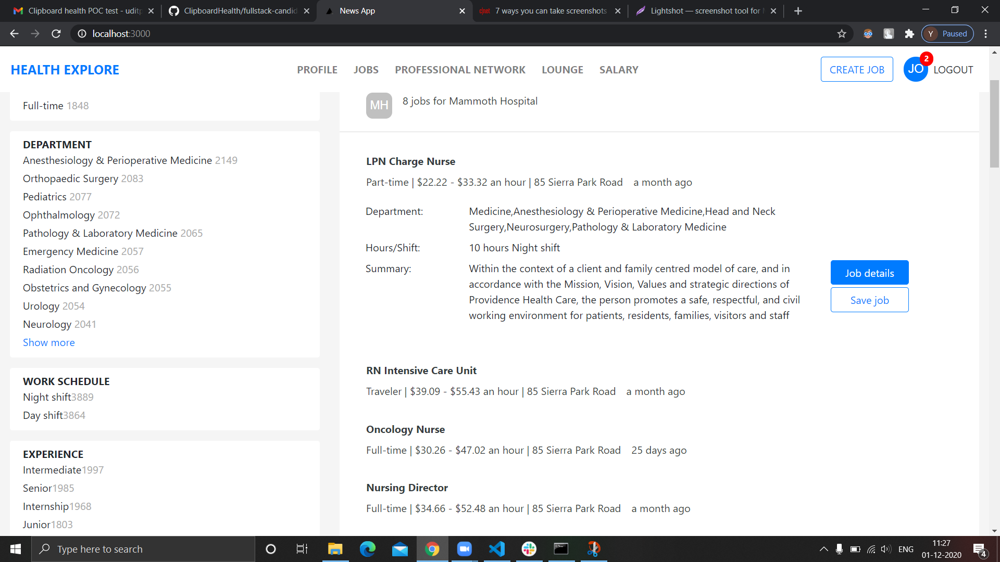
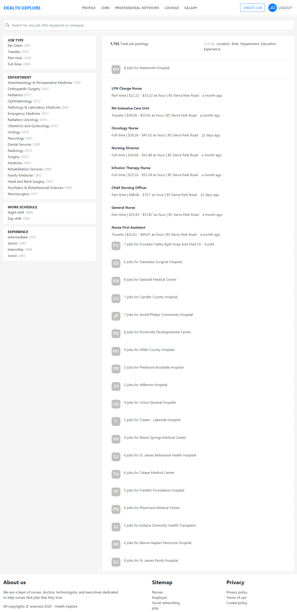
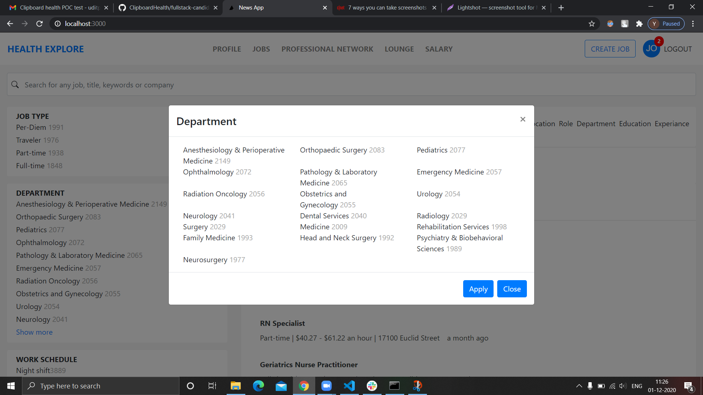
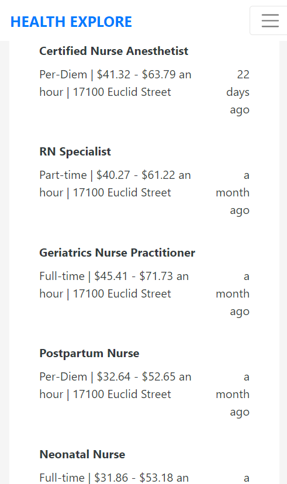
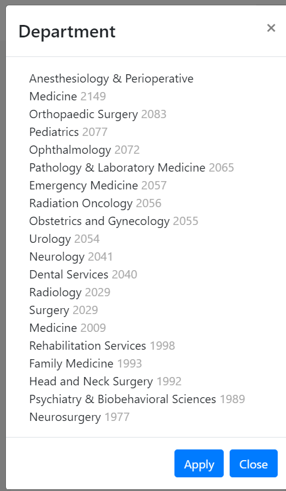
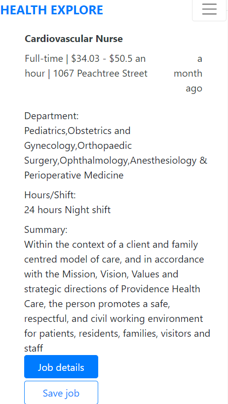

This is a [Next.js](https://nextjs.org/) project bootstrapped with [`create-next-app`](https://github.com/vercel/next.js/tree/canary/packages/create-next-app).

## Pre requirements

- node
- npm
- Clone this repo
- run npm i
- To run Project locally npm run dev
- Server is running at: http://localhost:3000
- To run test cases npm run test

#Tech Stack

- NextJS
- React bootstrap
- Loadash
- Moment
- React Avtar
- Github with Vercel

## Getting Started

First, run the development server:

```bash
npm run dev
# or
yarn dev
```

Open [http://localhost:3000](http://localhost:3000) with your browser to see the result.

You can start editing the page by modifying `pages/index.js`. The page auto-updates as you edit the file.

## Learn More

To learn more about Next.js, take a look at the following resources:

- [Next.js Documentation](https://nextjs.org/docs) - learn about Next.js features and API.
- [Learn Next.js](https://nextjs.org/learn) - an interactive Next.js tutorial.

You can check out [the Next.js GitHub repository](https://github.com/vercel/next.js/) - your feedback and contributions are welcome!

## Deploy on Vercel

The easiest way to deploy your Next.js app is to use the [Vercel Platform](https://vercel.com/import?utm_medium=default-template&filter=next.js&utm_source=create-next-app&utm_campaign=create-next-app-readme) from the creators of Next.js.

Check out our [Next.js deployment documentation](https://nextjs.org/docs/deployment) for more details.

## Live DEMO Interface
Open https://entrust-biswajit-jena-2020-11-27.vercel.app/ with your browser to see the result.

## Live Demo Screenshots
- Desktop View



- Desktop Expanded View



- Show More Department View



- Mobile Main View



- Mobile Department List View



- Mobile Inner Details View




